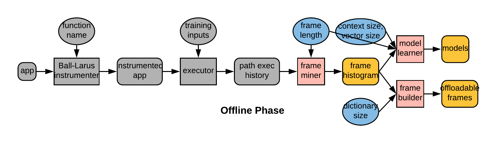

# Deepframe: A Profile-driven Compiler for Spatial Hardware Accelerators
Welcome! This repository represents the Norwegian University of Science and Technology (NTNU) version of Deepframe and Needle. These programs were originally created by groups work Simon Fraser University (SFU).

Links to the original research papers can be found here:

Needle: [https://ieeexplore.ieee.org/document/7920856](https://ieeexplore.ieee.org/document/7920856)  
Deepframe: [https://www2.cs.sfu.ca/~ashriram/papers/2019_PACT_DEEPFRAME.pdf](https://www2.cs.sfu.ca/~ashriram/papers/2019_PACT_DEEPFRAME.pdf)

## Building Needle and Deepframe

### Install dependencies

 1. `LLVM 3.8`
 2. `CMake 2.8.8`
 3. `gcc-5` or greater

### Build Needle
Deepframe can be thought of as an extension of Needle. As a result Needle needs to be built first in order for Deepframe to function. Currently Needle only has support for LLVM version 3.8.1. Other versions of LLVM may work in some cases, but they are not supported.

A script for installing LLVM `get_llvm.sh` is included in the `needle` sub-directory.   
**Caution!** Before using this script make sure to edit the necessary variables inside it so that LLVM is being downloaded for the operating system that you are using, and that the links for using `wget` are correct. Links and versions for LLVM downloads can be checked at [http://releases.llvm.org/](http://releases.llvm.org/).  

 1. Download LLVM `cd needle && ./get_llvm.sh && cd ..`
 2. Run make `mkdir needle-build && cd needle-build && cmake ../needle -DLLVM_DIR=../path_sequence/llvm-3.8/share/llvm/cmake && make -j 4`

## Running the frame maker

### Profile paths

 1. `$ cd needle-build/examples/workloads`
 2. initial setup: `$ make setup` 
 3. instrument paths: `$ make epp-inst` 
 4. collect path frequencies: `$ make epp-run` 
 5. list path names and contents: `$ make epp-decode` 

### Outline frames

 1. outline one frame:  `$ needle-build/bin/needle -u needle/lib/bitcode/helpers.bc -fn <function name to outline from> -seq=<file describing frame> -ExtractType::sequence <app bitcode file> -o <outlined binary file> 2>&1 > <log file>`
 3. outline a group of frames (each outline produces a different binary):  Please first select the target applications in `$ needle-build/examples/workloads/run-sequence.sh`. Then execute `$ needle-build/examples/workloads/run-sequence.sh <input type e.g. test, train> <frame length> <target frame coverage in range (0.0, 1.0)>`

## Using the frame miner

`$ deepframe/run_miner.sh <text file listing app profile filepaths one per line> <log of no. of Spark partitions (depends on profile size)> <input type> 0 <no. of frame lengths to mine> <value of each frame length>`

## Training the frame predictor
Comment out the line executing `validate.py` in `deepframe/run_path_pred.sh`.

`$ deepframe/run_path_pred.sh <text file listing app profile filepaths one per line> <log of no. of Spark partitions (depends on profile size)> <input type> <no. of different context sizes to train on> <value of each context size> <no. of different vector sizes to train on> <value of each vector size> <no. of different sample sizes to train on> <value of each sample size>`

## Training the frame predictor
Comment out the line executing `train.py` in `deepframe/run_path_pred.sh`.

`$ deepframe/run_path_pred.sh <text file listing app profile filepaths one per line> <log of no. of Spark partitions (depends on profile size)> <input type> <no. of different context sizes trained on> <value of each context size> <no. of different vector sizes trained on> <value of each vector size> <no. of different sample sizes trained on> <value of each sample size> <input type to validate on> <confidence threshold>`

